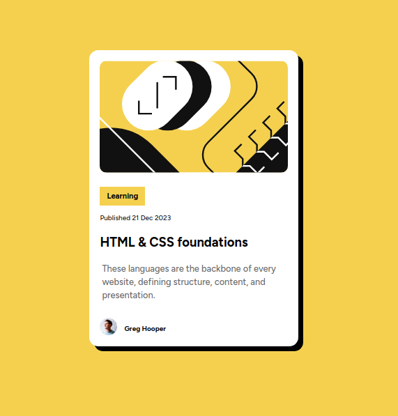

# Frontend Mentor - Blog preview card solution

This is a solution to the [Blog preview card challenge on Frontend Mentor](https://www.frontendmentor.io/challenges/blog-preview-card-ckPaj01IcS). Frontend Mentor challenges help you improve your coding skills by building realistic projects. 

## Table of contents

- [Overview](#overview)
  - [Blog-preview-card](#the-challenge)
  - [Blogpreviewcardscreenshot.png](#screenshot)
  - [Links](#links)
- [My process](#my-process)
  - [Flexbox](#built-with)
  - [Flexbox, em, rem, google fonts, hover](#what-i-learned)
  - [Flexbox, CSS Grid and Bootstarp](#continued-development)
  - [web.dev, discord communuty](#useful-resources)
- [Dinesh Rawat](#author)
- [Acknowledgments](#acknowledgments)


## Overview

### The challenge

Users should be able to:

- See hover and focus states for all interactive elements on the page

### Screenshot




### Links

- Solution URL: [https://github.com/rawatdinesh10/Blog-preview-card]
- Live Site URL: [https://blog-preview-card-nu-wheat.vercel.app/]

## My process

### Built with

- Semantic HTML5 markup
- CSS custom properties
- Flexbox
- CSS hover state
- Google fonts
- Box-shadow
- 


### What I learned

I have learned about CSS flexbox in more details. I have learned CSS hover state, box-shadow and other properties as well. I learned how to use Google fonts in our projects.


```css
.container-box {
    display: flex;
    flex-direction: column;
    align-items: flex-start
    border: 1px solid black;
    border-radius: 13px;
    max-width:18.70rem;
    background-color: hsl(0, 0%, 100%);
    margin: 140px auto;
    box-shadow: 7px 7px;

} 


.learn:hover {
        color: blue;
    }
    ```


### Continued development

I want to practice more on flexbox and learn CSS Grid and Bootstrap also. I need to practice more to be comfortable in doing challenges.I


### Useful resources

- [https://developer.mozilla.org/en-US/docs/Learn/CSS/CSS_layout/Flexbox](https://www.example.com) - This helped me for learning Flexbox from basics. I really liked this Mozilla web docs and will use it going forward.


## Author

- Website - [Dinesh Rawat](www.linkedin.com/in/dinesh-rawat-b89085257)
- Frontend Mentor - [@rawatdinesh10](https://www.frontendmentor.io/profile/rawatdinesh10)
- Twitter - [@dineshrawat325](https://www.twitter.com/dineshrawat325)


## Acknowledgments

I would like to thank vishalpawarR and Grace-Snow who helped me in discord community. vishalpawarR provided me his solution of this challenge which helped me to get some tips to complete my challenge. Grace-Snow heleped me with font-size and max-width issues which heleped me to solve my problem. Thank you so much guys for your valuable help.

